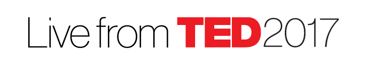

[Edit this page](https://github.com/TEDxShenzhen/TEDxShenzhen.github.io/edit/master/Live.md),
[wiki](https://github.com/TEDxShenzhen/TEDxShenzhen.github.io/wiki)

### What is TEDx?

In the spirit of ideas worth spreading, TED has created a program called TEDx. 
TEDx is a program of local, self-organized events that bring people together to share a TED-like experience. 
Our event is called TEDxShenzhen, where x = independently organized TED event. At our TEDxShenzhen event, 
TEDTalks video and live speakers will combine to spark deep discussion and connection in a small group. 
The TED Conference provides general guidance for the TEDx program, but individual TEDx events, including ours, are self-organized.
Text in the footer that states "This independent TEDx event is operated under license from TED."

### About TED and TEDx

See <http://www.ted.com> and [TEDx site](http://www.ted.com/about/programs-initiatives/tedx-program)

### TEDxShenzhenLive on April 27th 2017

TEDxShenzhenLive is
[TEDx](http://www.ted.com/about/programs-initiatives/tedx-program)
[Live](https://www.ted.com/participate/organize-a-local-tedx-event/before-you-start/event-types/tedxlive)
[event](http://www.ted.com/participate/organize-a-local-tedx-event/before-you-start/what-is-a-tedx-event)
prepared to be on 2017-4-27, the time TED Conference is happening.
It will screen live talks from TED Conference (or if there is Internet connection issue, show the talks that would be already delivered on the conference).

### Possible venues

(looking for sponsors)

### Organizers

- [Paul Verest](http://www.ted.com/profiles/7006699): Software Architect, Technical Manager, "making actions to get wishes closer", [Shenzhen Java User Group (SZJUG) organizer](http://szjug.github.io)
- [Sophie He](https://www.ted.com/profiles/4516086)

### Expected speakers

Speakers are those presenting on TED Conference.

### Registration

Register and see attendee list at <https://yoopay.cn/event/TEDxShenzhenLive> (<http://t.cn/RioNdSm>) or below.

Attention: start time, venue can be changed.
